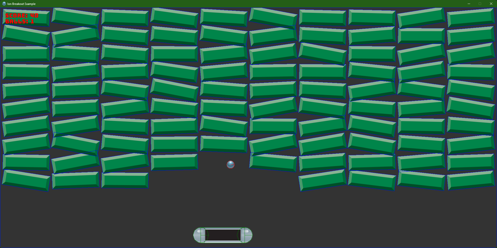

# Ion Engine
A small, positively-charged, middleware-based game engine for C#.

- **Modern:** Built using modern C# features and design patterns, Ion setup closely resembles ASP.NET Core in setup and configuration.
- **Modular:** Ion is a collection of modules that build on the `Ion.Core` module. You can use as many or as few modules as you want.
- **Middleware:** Using middleware, you can easily add functionality to the engine without having to modify the engine itself. This allows for easy extensibility and customization.

----

## Modules

### Ion.Core
A simple, modern code-first game engine inspired by Monogame and Bevy with an API like ASP.NET Core. This core module contains the core engine and all of the core features:
  - Application builder
  - Game loop
  - Events
  - Storage

### Ion.Extensions.Assets
Adds support for loading assets such as textures, models, and sounds.

### Ion.Extensions.Audio
Adds support for audio playback and manipulation.

### Ion.Extensions.Coroutines
Adds support for coroutines, allowing for async code to be run in a synchronous manner.

### Ion.Extensions.Debug
Adds support for debug utils such as a trace profiler and debug renderer.

### Ion.Extensions.Graphics.Veldrid
Adds window, input, and graphics support using the Veldrid API. Includes a built-in sprite batch for easy 2D rendering.

### Ion.Extensions.Scenes
Adds support for scenes that each have thier own scope for dependency injection!

----

## Planned Modules
 - Web-based UI Framework
 - Low-level Networking
 - Plugin-in Physics Engine Support
 - Multi-platform build support

## Built Using/Inspired By
  - [Veldrid](https://github.com/veldrid/veldrid) for Graphics
  - [Assimp.Net](https://github.com/StirlingLabs/Assimp.Net) for asset loading
  - [Peridot by Ezequias Silva](https://github.com/ezequias2d/peridot) for Sprite Batch
  - [Coroutines by ChevyRay](https://github.com/ChevyRay/Coroutines)

## Contributing

Feel free to check out the samples and open any issues or pull requests. If you have any questions, feel free to ask in the discussions tab.

## Examples

Check out the Breakout ECS example for a simple game using the Ion Engine.

----

## License
Ion Engine is [MIT licensed](./LICENSE).
