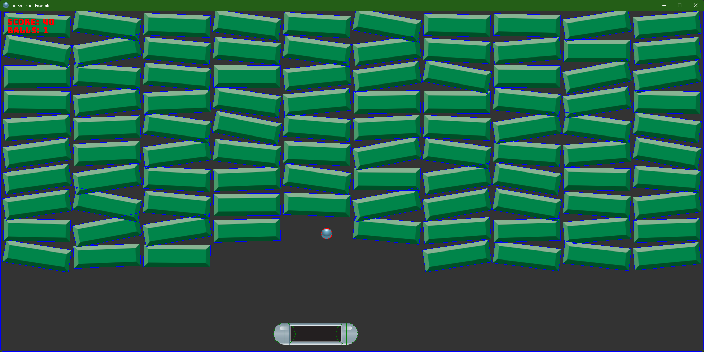

# Ion Engine
A small, positively-charged, middleware-based game engine for C#.

- **Modern:** Built using modern C# features and design patterns, Ion setup closely resembles ASP.NET Core in setup and configuration.
- **Modular:** Ion is a collection of modules that build on the `Ion.Core` module. You can use as many or as few modules as you want.
- **Middleware:** Using middleware, you can easily add functionality to the engine without having to modify the engine itself. This allows for easy extensibility and customization.

----

## Requirements

Ion targets `net10.0` and builds with the .NET 10 SDK (pinned in `global.json`, `rollForward: latestFeature`). The source generators target `netstandard2.0` on Roslyn 4.4, so they load in any compiler from the .NET 8 SDK onwards. Games can be published with NativeAOT (`dotnet publish -r <rid> -p:PublishAot=true`).

## Modules

### Ion.Core
A simple, modern code-first game engine inspired by Monogame and Bevy with an API like ASP.NET Core. This core module contains the core engine and all of the core features:
  - Application builder
  - Game loop
  - Events
  - Storage

### Ion.Extensions.Assets
Adds support for loading assets such as textures, models, and sounds. Load assets through their interfaces so the game runs on any backend:

```csharp
var tiles = assets.Load<ITexture2D>("tiles.png");
var font = assets.Load<IFontSet>("Bungee-Regular.ttf").CreateStyle(24); // or assets.LoadFontSet(name, files...)
var bonk = assets.Load<ISoundEffect>("bonk.wav");
```

Loading the same path twice returns the cached instance.

### Ion.Extensions.Audio
Adds support for audio playback and manipulation. `AddAudio()` plays through DirectSound (NAudio); `AddNullAudio()` is a headless `IAudioManager` that records every play in `NullAudioManager.Plays` and reads only WAV headers.

### Ion.Extensions.Coroutines
Adds support for coroutines, allowing for async code to be run in a synchronous manner.

### Ion.Extensions.Debug
Adds support for debug utils such as a trace profiler and debug renderer.

### Ion.Extensions.Graphics.Veldrid
Adds window, input, and graphics support using the Veldrid API. Includes a built-in sprite batch for easy 2D rendering.

### Ion.Extensions.Graphics.Null
A headless graphics backend with no window, GPU or SDL, for tests, servers and CI. `AddNullGraphics(config)` / `UseNullGraphics()` register everything the Veldrid backend does:
  - `NullWindow`: sized from `Ion:Window`, emits `WindowResizeEvent` at Init and `WindowClosedEvent` from `Close()` (which ends the game loop).
  - `NullInputState`: scripted input (`Press`, `Release`, `Tap`, `Click`, `SetMousePosition`, `Scroll`) applied at the start of the next frame.
  - `NullSpriteBatch`: draws nothing and records per-frame statistics (`LastFrame.DrawCalls`, `Sprites`, `Strings`, and the last draw commands).
  - Loaders that read texture sizes from image headers and fonts that measure text with a fixed glyph width.

### Running headless
`AddIon(config)` switches graphics and audio to the headless backends when `Ion:Headless` is `true` or `Ion:Graphics:Output` is `None`, and `UseIon()` adds the matching systems. Any game that depends only on the interfaces (`IWindow`, `IInputState`, `ISpriteBatch`, `IAudioManager`, `ITexture2D`, `IFontSet`, `ISoundEffect`) runs without a GPU, window or audio device:

```sh
dotnet run --project Ion.Examples/Ion.Examples.Breakout.ECS -- --Ion:Headless=true
```

In tests, resolve `NullInputState` to script input and `NullSpriteBatch` / `NullAudioManager` to assert on what was drawn and played, or use `IonTestHost` (below).

### Input and fixed steps
`IInputState` edges (`Pressed`, `Released`) and deltas (`WheelDelta`, `MouseDelta`) depend on the stage that reads them. From `First`, `Update`, `Render` and `Last` they describe the current frame. From `FixedUpdate` they describe everything since the previous fixed step, so a click is seen by exactly one fixed step even when `MaxFPS` is above `FixedUpdateRate` and some frames run no fixed step. Events get the same guarantee: an event that leaves the two-frame window before any fixed step ran is still delivered to `FixedUpdate` listeners. The loop publishes the running stage through `ILoopContext`.

## Testing
`Ion.Testing` runs a game headless on a deterministic `FixedStepClock` (one 60 Hz fixed step per frame by default), so tests can step it frame by frame and assert on services, draw counts, sounds and events:

```csharp
using Ion.Testing;

using var host = new IonTestHost()          // or new IonTestHost(TimeSpan.FromSeconds(1.0 / 120))
    .WithConfiguration("Ion:Seed", "42")
    .Configure(services => services.AddSingleton<ScoreSystem>())
    .WithSystem<PlayerSystem>();              // added after UseIon(), in order

var scores = host.Collect<ScoredEvent>();     // records every ScoredEvent the game emits

host.Step(10);                                // builds the app, runs Init, then 10 frames
host.Input.Click(MouseButton.Left);           // applied at the start of the next frame
Assert.True(host.RunUntil(() => scores.Count > 0, maxFrames: 600));

Assert.True(host.SpriteBatch.LastFrame.Sprites > 0);
Assert.NotEmpty(host.Audio.Plays);
Assert.Equal(1, host.Get<ScoreSystem>().Lives);
```

`Configure` and `ConfigureApp` add service registrations and pipeline setup, `WithConfiguration` adds settings, and `UseGame(configure, use)` builds a whole game that calls `AddIon`/`UseIon` itself (see `Ion.Examples/Ion.Examples.Breakout.ECS.Tests`, which plays 600 frames of Breakout with the autopilot and checks the run is deterministic). Disposing the host runs Destroy and disposes the application. `Screenshot()` throws `NotSupportedException` until the headless renderer lands.

### Ion.Extensions.Scenes
Adds support for scenes that each have thier own scope for dependency injection!

----

## Planned Modules
 - Web-based UI Framework
 - Low-level Networking
 - Plugin-in Physics Engine Support
 - Multi-platform build support

## Built Using/Inspired By
  - [Veldrid](https://github.com/veldrid/veldrid) for Graphics
  - [Peridot by Ezequias Silva](https://github.com/ezequias2d/peridot) for Sprite Batch
  - [Coroutines by ChevyRay](https://github.com/ChevyRay/Coroutines)

## Roadmap

See [docs/plans/2026-09-engine-review-and-roadmap.md](./docs/plans/2026-09-engine-review-and-roadmap.md) for the current review, benchmark baseline and staged plan. Micro-benchmarks live in `Ion/Ion.Benchmarks`.

## Contributing

Feel free to check out the samples and open any issues or pull requests. If you have any questions, feel free to ask in the discussions tab.

## Examples

Check out the Breakout ECS example for a simple game using the Ion Engine.


----

## License
Ion Engine is [MIT licensed](./LICENSE).
