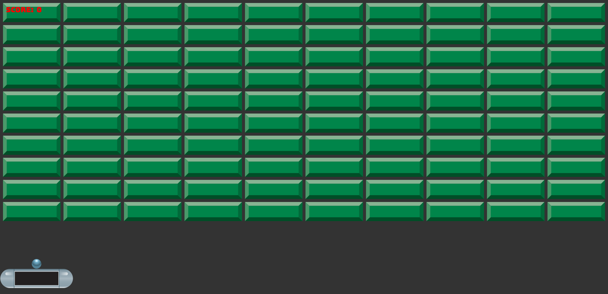

**Source:** [`Ion.Examples/Ion.Examples.Breakout`](https://github.com/jimbuck/Ion/tree/main/Ion.Examples/Ion.Examples.Breakout)
and its tests in [`Ion.Examples.Breakout.Tests`](https://github.com/jimbuck/Ion/tree/main/Ion.Examples/Ion.Examples.Breakout.Tests).

The classic brick breaker in one file and one class. There is no ECS and no physics engine: the game state is plain
fields and arrays, collisions are rectangle intersections, and a single system class has one step per stage it needs.
Start here to see the shape of every Ion game.



## What it shows

- The inline `Program.cs` setup: `AddIon` with an options delegate, `AddSystem`, `UseIon`, `UseSystem`, `Run`.
- A system with constructor-injected services (`IWindow`, `IInputState`, `ISpriteBatch`, `IEvents`, `IAssetManager`,
  `IAudioManager`) and steps in `Init`, `First`, `Update` and `Render`.
- Loading textures, a font and two sounds through the asset interfaces.
- Mouse capture (`IsMouseGrabbed`, `IsCursorVisible`) and sizing the window from code.
- Reading `WindowResizeEvent` with an `EventReader<T>`.
- Drawing sprites and text with the sprite batch, and playing sounds with a random pitch shift.

## Run it

```bash
dotnet run --project Ion.Examples/Ion.Examples.Breakout
npm run example:breakout          # the same, in Release
```

Click to capture the mouse, click again to launch the ball, and press Escape to release the mouse.

| Flag | Effect |
|---|---|
| `--Ion:Headless=true` | Headless graphics and audio (nothing to see, but it runs). |
| `--Ion:Headless:Render=true` | With headless: render offscreen with Vulkan. |
| `--Ion:Graphics:PreferredBackend=OpenGLES` | Use the OpenGL ES backend. |
| `--Ion:Metrics:Profiling=true` | Record every frame and write `trace.json` on exit (`Ion:Metrics:TraceOutput`). |

The sample's `appsettings.json` sets the title, `MaxFPS` 120 and a 1600 x 1600 window, which the game immediately
resizes to fit ten rows of ten blocks (2030 x 984). The project sets `<IonRemote>true</IonRemote>` so the
[remote protocol](/Ion/tooling/remote-protocol/) stays available in Release builds for agents and the `ion` tool's
end-to-end tests; it still only runs with `--remote`.

## Program.cs

The whole setup is four lines:

```csharp title="Program.cs"
var builder = IonApplication.CreateBuilder(args);
builder.AddIon(graphics => graphics.ClearColor = new Color(0x333)).AddSystem<BreakoutSystems>();

using var game = builder.Build();
game.UseIon().UseSystem<BreakoutSystems>();
game.Run();
```

- `AddIon` registers the engine core: metrics, assets, the window and input, graphics, the 2D renderer, audio,
  scenes, coroutines and the remote protocol. Its delegate configures `GraphicsConfig` after the `Ion:Graphics` section
  is bound; here it sets a dark grey clear color.
- `AddSystem<BreakoutSystems>()` registers the system as a singleton, and `UseSystem<BreakoutSystems>()` adds its steps
  to the schedule. Registration order does not matter: engine steps run in reserved order bands before and after
  yours (see [Stages](/Ion/concepts/stages/)).

## The system

`BreakoutSystems` takes its services in a primary constructor and keeps the game state in fields:

```csharp title="Program.cs"
public class BreakoutSystems(IWindow window, IInputState input, ISpriteBatch spriteBatch, IEvents events, IAssetManager assets, IAudioManager audio)
{
	private EventReader<WindowResizeEvent> _resizes = events.Reader<WindowResizeEvent>();

	private const int ROWS = 10;
	private const int COLS = 10;

	private readonly bool[] _blockStates = new bool[ROWS * COLS];
	private readonly RectangleF[] _blockRects = new RectangleF[ROWS * COLS];
	private RectangleF _paddleRect = new(0, 0, 244f, 64f);
	private RectangleF _ballRect = new(0, 0, 32f, 32f);
	// ...
}
```

The event reader is created once, in a field initializer, and kept in a field that is **not** `readonly`: reading
advances the reader, so a `readonly` field would read a copy and never move on (the generator reports that as
`ION106`).

### Init: load assets and lay out the level

```csharp
[Init]
public void SetupBlocks(GameTime dt)
{
	_blockTexture = assets.Load<ITexture2D>("15-Breakout-Tiles.png");
	_paddleTexture = assets.Load<ITexture2D>("49-Breakout-Tiles.png");
	_ballTexture = assets.Load<ITexture2D>("58-Breakout-Tiles.png");
	_bonkSound = assets.Load<ISoundEffect>("bonk.wav");
	_pingSound = assets.Load<ISoundEffect>("ping.mp3");
	_scoreFontSet = assets.Load<IFontSet>("Bungee-Regular.ttf");
	_scoreFont = _scoreFontSet.CreateStyle(24);

	// ... fill the block arrays ...

	window.Size = new Vector2((COLS * _blockSize.X) + ((COLS + 1) * _blockGap), (ROWS * _blockSize.Y) + ((ROWS + 1) * _blockGap) + _playerGap + _blockSize.Y + _bottomGap);
	window.IsResizable = false;

	_repositionBlocks();
}
```

Assets are loaded from the `Assets` folder next to the executable by path, through their interfaces
(`ITexture2D`, `ISoundEffect`, `IFontSet`), so the same code runs on the GPU renderer and the headless backends.
Loading a path twice returns the cached instance.

### First: react to window resizes

```csharp
[First]
public void HandleWindowResize(GameTime dt)
{
	if (_resizes.Read().Length > 0) _repositionBlocks();
}
```

`Read()` returns every unread event as a span. An event is visible in the frame it is emitted and the next one.

### Update: input, movement and collisions

```csharp
[Update]
public void Update(GameTime dt)
{
	var isMouseGrabbed = window.IsMouseGrabbed;

	if (input.Pressed(Key.Escape) && isMouseGrabbed)
	{
		window.IsMouseGrabbed = false;
		window.IsCursorVisible = true;
	}

	if (input.Pressed(MouseButton.Left) && !isMouseGrabbed)
	{
		window.IsMouseGrabbed = true;
		window.IsCursorVisible = false;
	}

	if (isMouseGrabbed) _paddleRect.X = Math.Clamp(input.MousePosition.X - (_paddleRect.Height / 2f), 0, window.Width - _paddleRect.Width);

	// Ball movement
	_ballRect.Location += _ballVelocity * _ballSpeed * dt;
	// ... wall, paddle and block collisions ...
	if (hitWall) audio.Play(_bonkSound, pitchShift: (_rand.NextSingle() - 0.5f) / 16f);
}
```

`GameTime` converts to the frame's delta in seconds (`dt.Delta`), so `velocity * speed * dt` is frame-rate
independent. The ball moves in `Update`, once per frame; the [ECS version](/Ion/examples/breakout-ecs/) moves it in
fixed steps through the physics module instead. Sounds get a small random pitch shift (in octaves) so repeated hits do
not sound identical.

### Render: sprites and text

```csharp
[Render]
public void Render(GameTime dt)
{
	for (var row = 0; row < ROWS; row++)
	{
		for (var col = 0; col < COLS; col++)
		{
			var i = (row * COLS) + col;
			if (_blockStates[i]) spriteBatch.Draw(_blockTexture, _blockRects[i]);
		}
	}

	spriteBatch.Draw(_paddleTexture, _paddleRect);
	spriteBatch.Draw(_ballTexture, _ballRect);
	spriteBatch.DrawString(_scoreFont, $"Score:  {_score}", new Vector2(20f), Color.Red);
}
```

The sprite batch system opens a batch around every Render stage, so any Render step can draw. `DrawString` caches the
laid-out glyphs per font and string.

## The tests

[`BreakoutRenderingTests`](https://github.com/jimbuck/Ion/blob/main/Ion.Examples/Ion.Examples.Breakout.Tests/BreakoutRenderingTests.cs)
runs the real `Program.cs` through `IonTestHost.UseEntryPoint<Program>()`:

| Test | What it checks |
|---|---|
| `MatchesTheGoldenImage` (`[VulkanFact]`) | 30 frames rendered headless on Vulkan at 2030 x 984: 109 sprites (100 blocks, the paddle, the ball and the 7 glyphs of "Score:  0"), the #333 background, and `Golden/breakout_30.png` within tolerance. |
| `MatchesTheGoldenImageOnGles` (`[GlesFact]`) | The same golden image on OpenGL ES: both backends render the same pixels. |
| `RunsWindowedOnVulkanWithoutValidationErrors` | 240 frames in a real window with the validation layer; any logged error fails. |
| `RunsWindowedOnGlesWithoutErrors` | 120 windowed frames on OpenGL ES. |

```csharp
var host = new IonTestHost().UseEntryPoint<Program>();
var shot = SampleRendering.Capture(host, Width, Height, 30, backend: backend, inspect: h =>
{
	var stats = h.Get<SpriteBatch>().LastFrameStatistics;
	Assert.Equal(102 + 7, stats.Sprites);
});
GoldenImage.AssertMatches(shot, RenderingEnvironment.GoldenPath("breakout_30.png"), tolerance: 8, maxMismatchRatio: 0.002);
```

## Ideas to extend it

**Lives and a game over.** Count lost balls in the existing "ball fell below the window" branch and show it next to the
score:

```csharp
private int _lives = 3;

// In Update, where the ball falls out:
if (_ballRect.Y > window.Height)
{
	_lives--;
	_ballVelocity = Vector2.Zero;
	_ballIsCaptured = true;
	_ballSpeed = _initialBallSpeed;
}

// In Render:
spriteBatch.DrawString(_scoreFont, $"Lives:  {_lives}", new Vector2(20f, 48f), Color.Red);
```

**Gamepad support.** Move the paddle with the left stick of the first gamepad as well as the mouse:

```csharp
var pad = input.Gamepad(0);
if (pad.IsConnected)
{
	_paddleRect.X = Math.Clamp(_paddleRect.X + pad.LeftStick.X * 900f * dt, 0, window.Width - _paddleRect.Width);
	if (pad.Pressed(GamepadButton.A) && _ballIsCaptured) { _ballIsCaptured = false; _ballVelocity = new Vector2(0, -1); }
}
```

**Split the class.** Move the score into its own system that reads an event, as the ECS version does. Events are
unmanaged structs:

```csharp
public record struct BlockBrokenEvent(int Index);

// In BreakoutSystems.Update, where a block is hit:
events.Emit(new BlockBrokenEvent(i));

public class ScoreSystem(IEvents events)
{
	private EventReader<BlockBrokenEvent> _broken = events.Reader<BlockBrokenEvent>();

	public int Score { get; private set; }

	[Update(Order = 10)]
	public void Tally(GameTime dt) => Score += 10 * _broken.Read().Length;
}
```

Register it with `builder.AddSystem<ScoreSystem>()` and `game.UseSystem<ScoreSystem>()`. `Order = 10` runs it after
the default-order gameplay step, so it counts the frame's hits in the same frame.

**A smoke test.** Add a test that plays the real program for a few seconds:

```csharp
using var run = IonTestHost.RunEntryPoint<Program>(300);
Assert.Equal(300, run.Frames);
Assert.True(run.LastFrame.Sprites >= 102);
```

## See also

- [Breakout ECS](/Ion/examples/breakout-ecs/): the same game on entities and physics.
- [Systems](/Ion/concepts/systems/) and [Stages](/Ion/concepts/stages/).
- [Sprites](/Ion/rendering/sprites/), [Text](/Ion/rendering/text/) and [Audio](/Ion/interaction/audio/).
- [Assets](/Ion/rendering/assets/).
