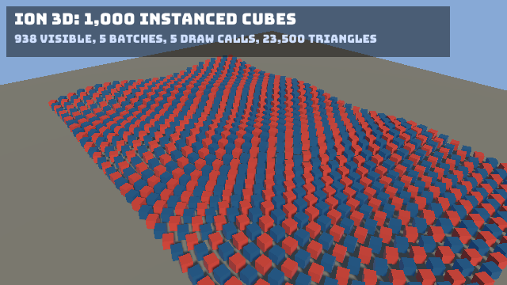

**Source:** [`Ion.Examples/Ion.Examples.Cubes`](https://github.com/jimbuck/Ion/tree/main/Ion.Examples/Ion.Examples.Cubes)
and its tests in [`Ion.Examples.Cubes.Tests`](https://github.com/jimbuck/Ion/tree/main/Ion.Examples/Ion.Examples.Cubes.Tests).

A 40 x 25 grid of cubes rolling in a wave over a ground plane, lit by a sun with shadows, seen from a camera that orbits
the grid. Every object is an ECS entity; the 3D extraction submits them to the renderer each frame, which batches the
1,000 cubes into one instanced draw per material. A 2D HUD shows the renderer's statistics on top.



## What it shows

- The 3D renderer with the ECS: `AddEcsRendering3D()`/`UseEcsRendering3D()` and the entity components `Transform`,
  `MeshRenderer`, `Camera`, `DirectionalLight` and `EntityName`.
- Creating meshes (`MeshPrimitives.Cube`, `Plane`) and PBR materials with `IRenderer3D`.
- The scene environment as a world singleton: `world.SetEnvironment(new SceneEnvironment { ... })`.
- A `[Query]` step on a `static` method that animates every cube through a generated chunk loop.
- Moving a camera by writing its entity's `Transform`.
- Instanced batching: two materials, so two opaque batches for 1,000 cubes.
- Drawing a HUD with the sprite batch over the 3D scene.
- A frame limit and screenshot on exit from the sample's own configuration keys.

## Run it

```bash
dotnet run --project Ion.Examples/Ion.Examples.Cubes
npm run example:cubes             # the same, in Release
dotnet run --project Ion.Examples/Ion.Examples.Cubes -- --Ion:Headless=true --Ion:Headless:Render=true --Cubes:Frames=120 --Cubes:Screenshot=cubes.png
```

| Flag | Effect |
|---|---|
| `--Cubes:Frames=<n>` | Exit after n rendered frames (and log the renderer statistics). |
| `--Cubes:Screenshot=<file>` | With `Cubes:Frames`, save the last frame as PNG (headless rendering, or windowed with `--Ion:Graphics:RetainLastFrame=true`). |
| `--Ion:Headless=true` | No window or GPU; the CPU side of the 3D pipeline (culling, sorting, batching) still runs. |
| `--Ion:Headless:Render=true` | With headless: render offscreen. |
| `--Ion:Rendering3D:Shadows=false` | Turn the shadow map off. |
| `--Ion:Rendering3D:DepthPrepass=true` | Draw a depth-only pass first. |

`appsettings.json` sets a 1280 x 720 window, `MaxFPS` 0 (uncapped) with VSync on, a 2048 shadow map and a 60-unit
shadow distance.

## Program.cs

```csharp title="Program.cs"
var builder = IonApplication.CreateBuilder(args);
builder.AddIon().AddRendering3D().AddEcs().AddEcsRendering3D().AddSystem<CubesSystem>();

using var game = builder.Build();
game.UseIon().UseRendering3D().UseEcs().UseEcsRendering3D().UseSystem<CubesSystem>();
game.Run();
```

Cubes lists every module for the reader. `AddEcsRendering3D()` alone registers the same set (the ECS module, the 3D
renderer and the engine core), as the [Model sample](/Ion/examples/model/) shows; calling a module twice registers it
once.

## Building the scene

`CubesSystem` is `partial` because it has a `[Query]` method. Its Init step creates the GPU resources and the entities:

```csharp title="Program.cs"
[Init]
public void Init(GameTime dt)
{
	var cube = renderer.CreateMesh(MeshPrimitives.Cube(0.8f));
	var ground = renderer.CreateMesh(MeshPrimitives.Plane(80f, 8));
	var red = renderer.CreateMaterial(new PbrMaterial(new Color(0xE0, 0x4A, 0x3B), metallic: 0f, roughness: 0.45f));
	var blue = renderer.CreateMaterial(new PbrMaterial(new Color(0x3B, 0x8E, 0xE0), metallic: 0.6f, roughness: 0.3f));
	var groundMaterial = renderer.CreateMaterial(new PbrMaterial(new Color(0x8A, 0x8A, 0x80), metallic: 0f, roughness: 0.9f));
	world.SetEnvironment(new SceneEnvironment { AmbientColor = new Color(0x9C, 0xB0, 0xD0), AmbientIntensity = 0.35f });

	_camera = world.Create(Orbit(0f), new Camera { FieldOfView = MathF.PI / 4, Near = 0.5f, Far = 200f, ClearColor = new Color(0x87, 0xA9, 0xD6) }, new EntityName("camera"));
	// The sun shines along its entity's -Z.
	world.Create(new Transform(Vector3.Zero, Transform.LookRotation(new Vector3(-0.65f, -0.6f, -0.3f), Vector3.UnitY)),
		new DirectionalLight(new Color(0xFF, 0xF4, 0xE0), intensity: 3f), new EntityName("sun"));
	world.Create(Transform.Identity, new MeshRenderer(ground, groundMaterial), new EntityName("ground"));

	for (var z = 0; z < Rows; z++)
	{
		for (var x = 0; x < Columns; x++)
		{
			var px = (x - (Columns - 1) * 0.5f) * Spacing;
			var pz = (z - (Rows - 1) * 0.5f) * Spacing;
			var material = ((x + z) & 1) == 0 ? red : blue;
			var grid = new GridCube(px, pz);
			world.Create(Wave(grid, 0f), new MeshRenderer(cube, material), grid);
		}
	}
}
```

- `CreateMesh` and `CreateMaterial` return handles (`MeshHandle`, `MaterialHandle`) that components store. Create them
  in an `[Init]` step: the renderer's own Init runs earlier, at `StageOrder.Rendering3D`.
- Cameras look down their entity's -Z and directional lights shine along it, so `Transform.LookAt` and
  `Transform.LookRotation` place them.
- `GridCube(X, Z)` is the game's own component: the cube's place in the grid, which the wave animates from.

## Animating with a query

```csharp title="Program.cs"
[Update, Query]
private static void Animate(ref Transform transform, in GridCube cube, GameTime dt) => transform = Wave(cube, (float)dt.Elapsed.TotalSeconds);

private static Transform Wave(in GridCube cube, float t)
{
	var y = 0.4f + 1.2f * (0.5f + 0.5f * MathF.Sin(cube.X * 0.35f + t * 1.5f) * MathF.Cos(cube.Z * 0.3f + t));
	return new Transform(new Vector3(cube.X, y, cube.Z), Quaternion.CreateFromAxisAngle(Vector3.UnitY, cube.X * 0.1f + t * 0.5f));
}
```

The generator turns `Animate` into a loop over every chunk holding `Transform` and `GridCube`, called directly by the
schedule. `ref` means the query writes the component, `in` means it only reads. A `GameTime` parameter receives the frame
time; `dt.Elapsed` is the total game time. The method can be `private` and `static`.

The camera moves by writing its entity's transform:

```csharp title="Program.cs"
[Update]
public void MoveCamera(GameTime dt)
{
	if (world.IsAlive(_camera)) world.Get<Transform>(_camera) = Orbit((float)dt.Elapsed.TotalSeconds);
}
```

Transform propagation computes the world matrices (`GlobalTransform`) in Render at `StageOrder.TransformPropagation`
(-400), and the 3D extraction submits the entities at `StageOrder.Extract` (-300), before the game's own Render steps.

## The HUD

```csharp title="Program.cs"
[Render]
public void Render(GameTime dt)
{
	if (_font is not null)
	{
		var stats = renderer.LastFrameStatistics;
		if (stats with { Frame = 0 } != _shownStats with { Frame = 0 })
		{
			_shownStats = stats;
			_statsText = $"{stats.Visible} visible, {stats.Batches} batches, {stats.DrawCalls} draw calls, {stats.Triangles:N0} triangles";
		}

		sprites.DrawRect(new Color(0, 0, 0, 0.45f), new Vector2(8, 8), new Vector2(560, 64));
		sprites.DrawString(_font, "Ion 3D: 1,000 instanced cubes", new Vector2(18, 14), Color.White);
		sprites.DrawString(_font, _statsText, new Vector2(18, 42), new Color(0xD0, 0xE0, 0xFF), scale: 0.7f);
	}

	_rendered++;
}
```

The 3D renderer draws the sprite batch as the last pass of its render graph, so 2D always lands on top. The text is
rebuilt only when the statistics change, so the HUD does not allocate every frame.

## Exiting after N frames

```csharp title="Program.cs"
[Last]
public void Last(GameTime dt)
{
	if (_done || _frames <= 0 || _rendered < _frames) return;
	_done = true;
	if (!string.IsNullOrEmpty(_screenshot) && services.GetService<IScreenshotSource>() is { } screenshots)
	{
		screenshots.SaveScreenshot(_screenshot);
	}

	events.Emit<ExitGameEvent>();
}
```

The engine's generic run settings (`--Ion:Run:Frames`, `--Ion:Run:Screenshot`) do the same for any game; this sample
predates them and keeps its own keys.

## The tests

| Test | What it checks |
|---|---|
| `RunsHeadlessWithoutAGpuAndBatchesTheCubes` | Headless without a device, 3 frames: 1,001 submitted (cubes and ground), one view, 5 batches (ground plus one per cube material in the opaque pass, one per mesh in the shadow pass), 1,001 shadow casters, one light; the world holds 1,001 mesh entities, a camera and a sun; the environment reached the renderer. |
| `RendersTheGoldenImageOnVulkan`, `RendersTheGoldenImageOnGles` | 30 frames at 640 x 360 match `Golden/cubes_640x360.png` on both backends; 5 batches and 5 draw calls; the frame's draw calls include the HUD's. |
| `RunsWindowedOnVulkanWithoutValidationErrors`, `RunsWindowedOnGlesWithoutErrors` | 120 windowed frames with no logged errors. |

```csharp title="CubesTests.cs"
using var host = new IonTestHost().UseEntryPoint<Program>();
host.Step(3);
var renderer = host.Get<Renderer3D>();
Assert.False(renderer.HasDevice);
var stats = renderer.LastFrameStatistics;
Assert.Equal(1001, stats.Submitted);
Assert.Equal(5, stats.Batches);
```

Without a GPU the renderer still culls, sorts and batches, so `LastFrameStatistics` is testable on any machine.

## Ideas to extend it

**Hide some cubes.** Hide one cube in five; the extraction skips entities with the `Hidden` tag:

```csharp
var entity = world.Create(Wave(grid, 0f), new MeshRenderer(cube, material), grid);
if ((x * 7 + z) % 5 == 0) world.SetHidden(entity, true);
```

**A point light that follows the wave.** Create an entity with `new Transform(new Vector3(0, 3, 0))` and
`new PointLight(Color.DarkOrange, intensity: 4f, range: 8f)`, and move it in `Update` like the camera.

**More materials.** Pick among four materials instead of two and watch the batch count go up in the HUD: one opaque
batch per material and mesh pair.

**Scale it up.** Change `Columns` and `Rows` to 100 x 100 and compare the statistics; `Renderer3DBenchmarks` measures
10,000 mesh renderers at about 1.2 ms of CPU with shadows.

## See also

- [3D overview](/Ion/rendering/3d/overview/), [Meshes and materials](/Ion/rendering/3d/meshes-and-materials/),
  [Lighting and shadows](/Ion/rendering/3d/lighting-and-shadows/), [Cameras](/Ion/rendering/3d/cameras/).
- [ECS rendering](/Ion/ecs/ecs-rendering/) and [Queries](/Ion/ecs/queries/).
- [Model](/Ion/examples/model/): glTF, PBR and a skybox.
