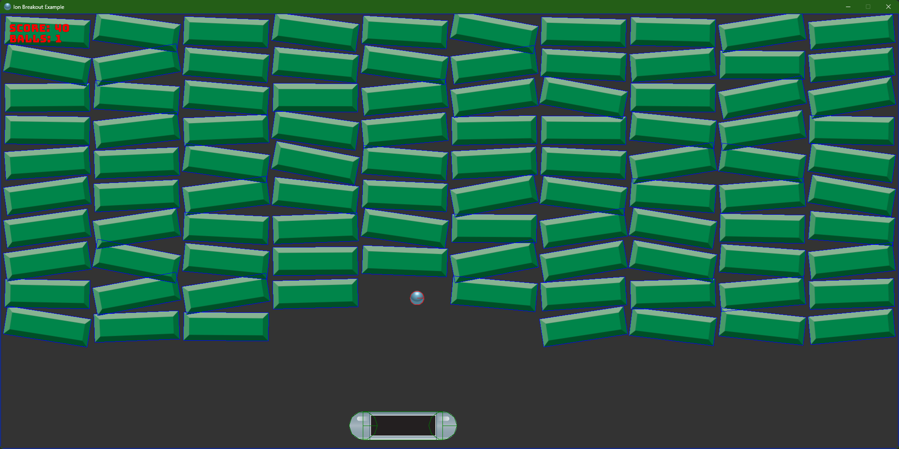

The repository's [`Ion.Examples`](https://github.com/jimbuck/Ion/tree/main/Ion.Examples) folder holds ten sample games.
Each is a small, complete program on the current API, with its setup inline in `Program.cs`, and most have a test
project that runs that same `Program.cs` headless (`IonTestHost.UseEntryPoint<Program>()`). Read them in the order
below to go from a single class to ECS, physics, networking and 3D.

## The samples

| Sample | Demonstrates | Main modules | Tests |
|---|---|---|---|
| [Breakout](/Ion/examples/breakout/) | The simplest complete game: one system class, sprites, text, sounds, input and window control. | `Ion` (`AddIon`) | Golden image on Vulkan and GLES; windowed runs |
| [Breakout ECS](/Ion/examples/breakout-ecs/) | The same game on the ECS: entities, `[Query]` steps, `Commands`, events, 2D physics, metrics, a headless autopilot and the Android and iOS heads. | ECS, ECS rendering, Physics2D | 600-frame autopilot, determinism, touch, generated schedule, golden images |
| [Breakout Net](/Ion/examples/breakout-net/) | Multiplayer: a server-authoritative game with replicated components, predicted paddles, network messages and a dedicated server mode. | Networking, LiteNetLib, Physics2D, ECS | Server and client convergence over loopback (lossy too) and UDP |
| [Companion](/Ion/examples/companion/) | The web server: `[Http]` and `[WebSocket]` endpoints, static files, push channels, and phones as virtual gamepads. | Web, scripted input | HTTP and WebSocket end to end |
| [Menu](/Ion/examples/menu/) | Immediate-mode UI: panels, buttons, toggle, slider, list, text input, gamepad focus navigation, and remote driving. | UI, UI remote | Driven through `IUiTree`, devices and the remote protocol; golden image |
| [Cubes](/Ion/examples/cubes/) | 3D on the ECS: 1,000 instanced cubes animated by a `[Query]`, shadows, an orbiting camera entity and a 2D HUD. | Rendering3D, ECS rendering 3D | CPU pipeline statistics headless; golden image on both backends |
| [Model](/Ion/examples/model/) | glTF 2.0 and PBR: a model spawned as entities, metal spheres, point lights and a skybox with image-based ambient. | Rendering3D, ECS rendering 3D | Model loading and entity tree; golden image |
| [Scenes](/Ion/examples/scenes/) | Scenes with their own schedules, function steps, scopes, coroutines, profiling keys, and composing the engine by hand. | Scenes, Coroutines, Metrics | Each scene rendered and compared with a golden image |
| [Sprites 100k](/Ion/examples/sprites-100k/) | The sprite batch stress test: 100,000 moving sprites in 16 draw calls. | Rendering2D | Batching under validation; frame times |
| [Quad](/Ion/examples/quad/) | The smallest app on the Silk.NET stack: a textured quad drawn through the RHI with build-time shaders. | Windowing, RHI (Vulkan, GLES) | Used by the Vulkan and GLES backend test suites |



## Running a sample

Every sample is an executable project. From the repository root:

```bash
dotnet run --project Ion.Examples/Ion.Examples.Breakout.ECS
```

The root `package.json` has a Release shortcut for each one (`npm install` once first): `npm run example:breakout`,
`example:breakout-ecs`, `example:breakout-net`, `example:companion`, `example:menu`, `example:cubes`, `example:model`,
`example:scenes`, `example:sprites` and `example:quad`. Arguments follow `--`, as with `dotnet run`:

```bash
npm run example:breakout-ecs -- --headless --Ion:Run:Frames=600
```

Everything after `--` is configuration. These keys work in every sample that uses `AddIon`:

| Flag | Effect |
|---|---|
| `--Ion:Headless=true` (or `--headless`) | No window, GPU or audio device: the null graphics and audio backends. |
| `--Ion:Headless:Render=true` (or `--headless-render`) | With headless: render offscreen on Vulkan (lavapipe) or OpenGL ES (EGL). |
| `--Ion:Graphics:PreferredBackend=OpenGLES` | Force the OpenGL ES backend (default `Auto`: Vulkan first on desktop). |
| `--Ion:Window:Platform=Sdl` | Use SDL instead of GLFW. |
| `--Ion:Run:Frames=600` | Run 600 frames and exit. |
| `--Ion:Run:Screenshot=out.png` | Save the last frame (needs headless rendering or a window). |
| `--Ion:Seed=42` | The random seed (Breakout ECS reads it). |
| `--Ion:PrintSchedule=true` | Print every stage's steps at startup. |
| `--Ion:Metrics:Overlay=true --Ion:Metrics:OverlayFont=Bungee-Regular.ttf` | Draw fps, frame time and counters. |

```bash
# Play Breakout ECS headless for ten seconds of game time, rendering offscreen, and keep the last frame.
dotnet run --project Ion.Examples/Ion.Examples.Breakout.ECS -- --headless-render --Ion:Run:Frames=600 --Ion:Run:Screenshot=breakout.png
```

The [`ion` tool](/Ion/tooling/ion-cli/) wraps the same settings and adds a JSON summary:

```bash
ion run Ion.Examples/Ion.Examples.Breakout.ECS --headless --frames 600 --seed 1 --screenshot out/frame.png --summary out/run.json
ion schedule Ion.Examples/Ion.Examples.Cubes
```

Some samples have their own keys: `Cubes:Frames` and `Cubes:Screenshot`, `Model:Frames` and `Model:Screenshot`,
`Quad:Frames`, `Quad:Screenshot` and `Quad:Spin`, and `Sprites:Count`, `Sprites:Textures` and `Sprites:Frames`.

:::note[Linux prerequisites]
Windowed runs need the X11 or Wayland client libraries; headless rendering needs Mesa (`mesa-vulkan-drivers` for
lavapipe, `libegl-mesa0` for OpenGL ES through EGL). See [Desktop](/Ion/platforms/desktop/).
:::

## Running the tests

Each `Ion.Examples.*.Tests` project runs its sample's own `Program.cs`:

```bash
dotnet test Ion.Examples/Ion.Examples.Breakout.ECS.Tests
xvfb-run -a dotnet test Ion.sln -c Release      # everything, with a virtual display for the windowed tests
```

The tests share helpers from [`Ion.Examples/Shared/SampleRenderingTest.cs`](https://github.com/jimbuck/Ion/blob/main/Ion.Examples/Shared/SampleRenderingTest.cs):

| Helper | What it does |
|---|---|
| `[VulkanFact]` | Skips the test when no Vulkan driver is installed. |
| `[GlesFact]` | Skips the test when EGL cannot create an OpenGL ES 3 context. |
| `[WindowedVulkanFact]` | Skips the test without a display or a Vulkan driver. |
| `SampleRendering.Capture(host, width, height, frames, inspect, backend)` | Steps the host headless with rendering on, returns the last frame, and fails on any logged error (validation included). |
| `SampleWindowed.Run<Program>(frames, settings)` | Runs the sample's entry point in a real window on the real clock with validation on, and fails on any logged error. |

Golden images live in each test project's `Golden/` folder. Set `ION_UPDATE_GOLDEN=1` to refresh them after an
intended visual change (see [Snapshots and goldens](/Ion/tooling/snapshots-and-goldens/)).

A minimal test of a sample, in the style they all use:

```csharp
using Ion.Testing;
using Xunit;

public class SmokeTests
{
	[Fact]
	public void RunsSixtyFramesHeadless()
	{
		using var run = IonTestHost.RunEntryPoint<Program>(60);
		Assert.Equal(60, run.Frames);
		Assert.True(run.LastFrame.Sprites > 0);
	}
}
```

## Common problems

- **A test is skipped with "No Vulkan driver" or "No EGL OpenGL ES 3 driver".** The rendering tests need Mesa: on
  Debian and Ubuntu, `mesa-vulkan-drivers` for lavapipe and `libegl1 libegl-mesa0` for OpenGL ES. Skipped is not
  failed; the headless tests without rendering still run.
- **"No display" skips the windowed tests.** Run them under `xvfb-run -a` on Linux, or on a desktop session.
- **The window opens on a machine without Vulkan.** Pass `--Ion:Graphics:PreferredBackend=OpenGLES`, or run headless
  with `--headless-render` to keep rendering offscreen.
- **A golden image test fails after a rendering change you meant to make.** Re-run the tests with
  `ION_UPDATE_GOLDEN=1` (`npm run goldens:update` does it for the whole solution) and commit the new PNGs.
- **Frame times look slow.** Debug builds of the engine and the samples are much slower in per-sprite and per-entity
  loops; use `-c Release` or the `npm run example:*` scripts.

## Publishing a sample

Every sample publishes with the NativeAOT presets:

```bash
dotnet publish Ion.Examples/Ion.Examples.Menu -p:IonTarget=linux-x64
dotnet publish Ion.Examples/Ion.Examples.Breakout.ECS -p:IonTarget=r36s -p:IonArm64SysRoot=$HOME/sysroot-bionic-arm64
```

See [Publishing](/Ion/platforms/publishing/) for each sample's size and startup time.

## How the samples reference the engine

The samples use `ProjectReference`s into `Ion/`, and reference the source generators as analyzers:

```xml
<ItemGroup>
  <ProjectReference Include="..\..\Ion\Ion.Generators\Ion.Generators.csproj" OutputItemType="Analyzer" ReferenceOutputAssembly="false" GlobalPropertiesToRemove="PublishAot;RuntimeIdentifier;SelfContained" />
  <ProjectReference Include="..\..\Ion\Ion\Ion.csproj" />
</ItemGroup>
```

A game of your own references the NuGet packages instead (the generator ships inside the `Ion` package). The
[templates](/Ion/getting-started/templates/) set that up.

## See also

- [First game](/Ion/getting-started/first-game/): build a game step by step.
- [Testing](/Ion/tooling/testing/): `IonTestHost` in depth.
- [Module map](/Ion/reference/module-map/): every package the samples use.
