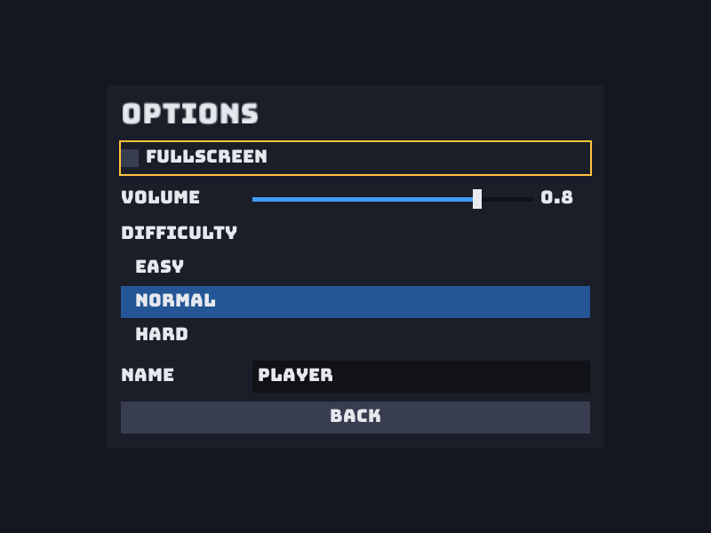

**Source:** [`Ion.Examples/Ion.Examples.Menu`](https://github.com/jimbuck/Ion/tree/main/Ion.Examples/Ion.Examples.Menu)
and its tests in [`Ion.Examples.Menu.Tests`](https://github.com/jimbuck/Ion/tree/main/Ion.Examples/Ion.Examples.Menu.Tests).

Three screens (main, options, play) built with the UI module's immediate-mode API. One `[Update]` step describes the
current screen every frame; widgets return what happened to them, and the settings live in a plain class. The same
menu works with the mouse, the keyboard, a gamepad alone (the R36S has nothing else), and an agent driving it by widget
path over the remote protocol.



## What it shows

- `AddUi()`/`UseUi()` and the `Ui` context: `Panel`, `Label`, `Button`, `Toggle`, `Slider`, `List`, `TextInput` and
  `BackPressed`.
- Theming with `UiTheme.Default with { ... }` and a root layout (`UiStyle` with `Justify` and `AlignItems`).
- Explicit widget keys (`"title"`, `"greeting"`) and labels built from a `Span<char>` without allocating.
- Automatic focus for gamepad-only devices, and Back on gamepad B or Escape.
- `ExitGameEvent` to quit, and `IWindow.IsFullscreen` from a toggle.
- `AddUiRemote()`: the `ui.tree`, `ui.click`, `ui.set_value`, `ui.focus`, `ui.type` and `ui.back` remote methods.
- Tests that drive the UI through `IUiTree` only, through scripted devices, and through JSON-RPC.

## Run it

```bash
dotnet run --project Ion.Examples/Ion.Examples.Menu
npm run example:menu              # the same, in Release
dotnet run --project Ion.Examples/Ion.Examples.Menu -- --remote-allow-mutations     # let an agent drive it
```

| Input | Action |
|---|---|
| Mouse | Hover and click; drag the slider. |
| Arrow keys or Tab | Move the focus; Left and Right change a focused slider. |
| Enter or Space | Activate the focused widget; Enter also starts and ends text editing. |
| Escape | Back to the main menu. |
| Gamepad D-pad or left stick | Move the focus; change sliders. |
| Gamepad A / B | Activate / back. |

The sample's `appsettings.json` sets an 800 x 600 window at 60 fps.

## Program.cs

```csharp title="Program.cs"
var builder = IonApplication.CreateBuilder(args);
builder.AddIon(graphics => graphics.ClearColor = new Color(0x14, 0x17, 0x20, 0xFF)).AddUi().AddUiRemote().AddSystem<MenuSystem>();
builder.Services.AddSingleton<MenuSettings>();

using var game = builder.Build();
game.UseIon().UseUi().UseSystem<MenuSystem>();
game.Run();
```

`AddUi()` registers the UI module and the engine core; `UseUi()` adds its systems: a scope around Update at
`StageOrder.UiFrame` (-550), which applies queued tree commands and reads input against the previous frame's layout
before your steps and lays out the frame after them, and the drawing step in Render at `StageOrder.Ui` (700).
`AddUiRemote()` adds the UI's remote methods; they are only reachable when the remote protocol runs (`--remote`).

## The settings and the screens

```csharp title="Program.cs"
public enum MenuScreen { Main, Options, Play }

public sealed class MenuSettings
{
	public static readonly string[] Difficulties = ["Easy", "Normal", "Hard"];
	public bool Fullscreen;
	public float Volume = 0.8f;
	public int Difficulty = 1;
	public string PlayerName = "Player";
}
```

The fields are passed by `ref` to the widgets, which edit them in place.

### Theme and root layout

```csharp title="Program.cs"
[Init]
public void Load(GameTime dt)
{
	var font = assets.Load<IFontSet>("Bungee-Regular.ttf").CreateStyle(20);
	ui.Theme = UiTheme.Default with { Font = font, LabelWidth = 140, InputWidth = 200 };
	ui.RootStyle = new UiStyle { Justify = UiJustify.Center, AlignItems = UiAlign.Center };
}
```

### Describing a screen

```csharp title="Program.cs"
[Update]
public void Build(GameTime dt)
{
	switch (Screen)
	{
		case MenuScreen.Main: Main(); break;
		case MenuScreen.Options: Options(); break;
		default: Play(); break;
	}
}

private void Options()
{
	using (ui.Panel("options", new UiStyle { Width = 560, Gap = 10 }))
	{
		ui.Label("Options", "title", scale: 1.6f);
		if (ui.Toggle("Fullscreen", ref settings.Fullscreen)) window.IsFullscreen = settings.Fullscreen;
		ui.Slider("Volume", ref settings.Volume, 0f, 1f, 0.05f);
		ui.List("Difficulty", MenuSettings.Difficulties, ref settings.Difficulty);

		ui.TextInput("Name", ref settings.PlayerName, maxLength: 16);
		if (ui.Button("Back") || ui.BackPressed) Screen = MenuScreen.Main;
	}
}
```

- Containers such as `Panel` return a scope to dispose; everything inside is its children.
- Each widget has a path made of its container keys and its own key or label, such as `options/Volume` or
  `options/Difficulty/Hard`. Tests and agents address widgets by these paths.
- `Toggle` returns true when the value changed this frame, `Button` when it was activated.
- `ui.BackPressed` is true when the player pressed Back (Escape or gamepad B).

### Labels without allocating

```csharp title="Program.cs"
private void Main()
{
	using (ui.Panel("main", new UiStyle { Width = 360, Gap = 12 }))
	{
		ui.Label("Ion Menu", "title", scale: 1.6f);
		Span<char> greeting = stackalloc char[48];
		var length = Concat(greeting, "Welcome, ", settings.PlayerName);
		ui.Label(greeting[..length], "greeting", color: UiTheme.Default.TextDisabled);
		if (ui.Button("Play")) Screen = MenuScreen.Play;
		if (ui.Button("Options")) Screen = MenuScreen.Options;
		if (ui.Button("Quit")) events.Emit(new ExitGameEvent());
	}
}
```

`Label` accepts a `ReadOnlySpan<char>` and interns the text, so a greeting built on the stack every frame does not
allocate. The UI allocates nothing per frame once every widget has been seen.

## Driving it without a person

### Through IUiTree (in-process)

`IUiTree` lists the nodes of the last UI frame and queues commands applied at the start of the next frame's Update, as
the equivalent input would be:

```csharp title="MenuTests.cs"
using var host = new IonTestHost().UseEntryPoint<Program>();
host.Step();
var tree = host.Get<IUiTree>();

Assert.Equal(["main", "main/title", "main/greeting", "main/Play", "main/Options", "main/Quit"], tree.Snapshot().Select(n => n.Path));
Assert.Equal("main/Play", tree.FocusedPath);

Assert.True(tree.Click("main/Options"));
Assert.True(host.RunUntil(() => tree.TryFind("options/Back", out _), maxFrames: 5));

Assert.True(tree.SetValue("options/Volume", "0.35"));
Assert.True(tree.Click("options/Difficulty/Hard"));
host.Step();
Assert.Equal(2, host.Get<MenuSettings>().Difficulty);
```

A screen change shows from the frame after the click, which is why the test steps until the new path appears.

### Through the remote protocol (out of process)

Run the menu with `--remote-allow-mutations` and an agent or script calls JSON-RPC methods with the token from the run
directory's `remote.json`:

```bash
ion remote ui.tree --project Ion.Examples/Ion.Examples.Menu
ion remote ui.click '{"path":"main/Options"}' --project Ion.Examples/Ion.Examples.Menu
ion remote ui.set_value '{"path":"options/Volume","value":0.35}' --project Ion.Examples/Ion.Examples.Menu
```

`MenuRemoteTests` does exactly this over HTTP: discovers the `ui.*` methods with `rpc.discover`, reads the tree, changes
every option by path, types into the name field, goes back, plays, and quits, then checks the game state followed.

### Through devices

`MenuInputTests` drives the same menu with scripted devices: the gamepad alone (D-pad down to Options, A to enter, A to
toggle fullscreen, D-pad left to lower the volume by one step to 0.75, down to "Hard" and A, B to go back), and the
keyboard and mouse (Tab to the name field, Enter, Backspace, type "Grace", click Back at its rectangle).

## The tests

| Class | What it checks |
|---|---|
| `MenuTreeTests` | Every option changed and the game played through `IUiTree` only; the tree and its `Version` stay unchanged while nothing happens. |
| `MenuInputTests` | The gamepad alone reaches and changes every option; keyboard text editing and a mouse click. |
| `MenuRemoteTests` | An agent drives the menu end to end through the remote protocol, without screenshots. |
| `MenuRenderingTests` | The options screen rendered headless on Vulkan matches `Golden/menu_options.png`. |

## Publishing

The Menu sample is in the CI AOT lane and publishes with no trim or AOT warnings at all:

```bash
dotnet publish Ion.Examples/Ion.Examples.Menu -p:IonTarget=linux-x64      # 11.7 MB
```

## Ideas to extend it

**Apply the volume.** Inject `IAudioManager` and set `audio.MasterVolume = settings.Volume` when the slider changes
(`Slider` returns true on change, like `Toggle`).

**Save the settings.** Write `MenuSettings` to the per-user folder (`IPersistentStorage.User`) with a source-generated
`JsonSerializerContext` when leaving the options screen, and load it at Init.

**A scrolling credits screen.** Add a `MenuScreen.Credits` case that builds a `ui.ScrollView("credits", ...)` with many
labels; wheel and focus navigation scroll it.

**Scenes per screen.** For bigger games, put each screen in its own [scene](/Ion/ecs/scenes/) and switch with
`EmitChangeScene` instead of an enum.

## See also

- [UI overview](/Ion/interaction/ui/overview/), [Widgets](/Ion/interaction/ui/widgets/),
  [Layout and styling](/Ion/interaction/ui/layout-and-styling/), [Focus navigation](/Ion/interaction/ui/focus-navigation/).
- [UI on the remote protocol](/Ion/interaction/ui/ui-remote/) and [Remote protocol](/Ion/tooling/remote-protocol/).
- [Agentic development](/Ion/tooling/agentic-development/).
