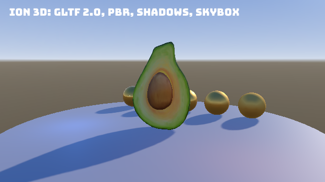

**Source:** [`Ion.Examples/Ion.Examples.Model`](https://github.com/jimbuck/Ion/tree/main/Ion.Examples/Ion.Examples.Model)
and its tests in [`Ion.Examples.Model.Tests`](https://github.com/jimbuck/Ion/tree/main/Ion.Examples/Ion.Examples.Model.Tests).

Microsoft's CC0 "Avocado" from the Khronos glTF Sample Assets, with base color, metallic-roughness and normal maps, on a
pedestal next to a row of gold spheres from rough to polished. A sun casts shadows, a warm and a cool point light add
color, and a procedural skybox fills the background and lights the scene through its mips. The camera circles the
scene. Everything is an entity.



## What it shows

- The shortest 3D setup: `builder.AddEcsRendering3D()` and `game.UseEcsRendering3D()` bring the engine, the 3D renderer
  and the ECS module.
- Loading a glTF 2.0 model with `assets.Load<IModel>("Avocado/Avocado.gltf")` and a cube map with
  `assets.Load<ICubemap>("Skybox")`.
- `world.SpawnModel(model, transform)`: one root entity, one entity per glTF node with its transform, parent and name,
  and a `MeshRenderer` per primitive.
- A PBR material sweep (`metallic: 1f`, roughness 0.1 to 0.9), `MeshPrimitives.Sphere` and `Cylinder`.
- `SceneEnvironment` with a skybox (`CameraClear.Skybox`) and image-based ambient.
- `DirectionalLight` and `PointLight` entities.
- A game component (`Spin`) animated by a `[Query]` step on the spawned root.

## Run it

```bash
dotnet run --project Ion.Examples/Ion.Examples.Model
npm run example:model             # the same, in Release
dotnet run --project Ion.Examples/Ion.Examples.Model -- --Ion:Headless=true --Ion:Headless:Render=true --Model:Frames=60 --Model:Screenshot=model.png
```

| Flag | Effect |
|---|---|
| `--Model:Frames=<n>` | Exit after n rendered frames. |
| `--Model:Screenshot=<file>` | With `Model:Frames`, save the last frame as PNG. |
| `--Ion:Headless=true` | No window; the model still loads and the CPU pipeline still runs. |
| `--Ion:Headless:Render=true` | With headless: render offscreen. |
| `--Ion:Graphics:PreferredBackend=OpenGLES` | Render with OpenGL ES (the pixels match Vulkan's). |

`appsettings.json` sets a 1280 x 720 window, VSync, a 2048 shadow map and a 20-unit shadow distance (the scene is small,
so a short distance keeps the shadow map's texels dense).

## Program.cs

```csharp title="Program.cs"
var builder = IonApplication.CreateBuilder(args);
builder.AddEcsRendering3D().AddSystem<ModelSystem>();

using var game = builder.Build();
game.UseEcsRendering3D().UseSystem<ModelSystem>();
game.Run();
```

`AddEcsRendering3D` registers what it needs (the engine, the 3D renderer, the ECS module) and `UseEcsRendering3D` adds
their systems. Listing them too (`builder.AddIon().AddRendering3D().AddEcs()...`) changes nothing.

## Loading and spawning

```csharp title="Program.cs"
[Init]
public void Init(GameTime dt)
{
	_model = assets.Load<IModel>("Avocado/Avocado.gltf");
	var skybox = assets.Load<ICubemap>("Skybox");
	world.SetEnvironment(new SceneEnvironment { AmbientColor = new Color(0x40, 0x48, 0x58), AmbientIntensity = 0.15f, Skybox = skybox.Handle, SkyboxIntensity = 1f });

	var sphere = renderer.CreateMesh(MeshPrimitives.Sphere(0.45f, 48, 24));
	var pedestal = renderer.CreateMesh(MeshPrimitives.Cylinder(4.5f, 0.3f, 64));
	for (var i = 0; i < 5; i++)
	{
		var roughness = 0.1f + 0.2f * i;
		var material = renderer.CreateMaterial(new PbrMaterial(new Color(0xE6, 0xB8, 0x5C), metallic: 1f, roughness: roughness));
		world.Create(new Transform(new Vector3((i - 2) * 1.2f, 0.45f, -2.2f)), new MeshRenderer(sphere, material), new EntityName($"sphere {i}"));
	}

	var pedestalMaterial = renderer.CreateMaterial(new PbrMaterial(new Color(0xB0, 0xB4, 0xBC), metallic: 0f, roughness: 0.6f));
	world.Create(new Transform(new Vector3(0, -0.15f, 0)), new MeshRenderer(pedestal, pedestalMaterial), new EntityName("pedestal"));

	// The model: a root entity (scaled and turned by Spin) with one entity per glTF node under it.
	_avocado = world.SpawnModel(_model, new Transform(Vector3.Zero, Quaternion.Identity, new Vector3(AvocadoScale)));
	world.Add(_avocado, new Spin(0.4f));

	_camera = world.Create(Orbit(0f), new Camera { FieldOfView = MathF.PI / 4, Near = 0.1f, Far = 100f, Clear = CameraClear.Skybox }, new EntityName("camera"));
	world.Create(new Transform(Vector3.Zero, Transform.LookRotation(-Vector3.Normalize(new Vector3(0.35f, 0.55f, -1f)), Vector3.UnitY)),
		new DirectionalLight(new Color(0xFF, 0xF0, 0xDC), intensity: 2.5f), new EntityName("sun"));
	world.Create(new Transform(new Vector3(2.5f, 1.8f, 1.5f)), new PointLight(new Color(0xFF, 0x90, 0x40), intensity: 2.5f, range: 5f), new EntityName("warm light"));
	world.Create(new Transform(new Vector3(-2.5f, 1.2f, 1f)), new PointLight(new Color(0x50, 0x90, 0xFF), intensity: 2.5f, range: 5f), new EntityName("cool light"));
}
```

### The assets

| Path | What it is |
|---|---|
| `Assets/Avocado/Avocado.gltf`, `Avocado.bin` | The glTF 2.0 model, unchanged from the Khronos sample. |
| `Assets/Avocado/Avocado_baseColor.png`, `_normal.png`, `_roughnessMetallic.png` | The three textures, downscaled from 2048 to 256 pixels to keep the repository small. |
| `Assets/Skybox/px.png` ... `nz.png` | A procedural sky rendered into six 128 x 128 cube map faces, CC0, made for this sample. |

`Load<ICubemap>("Skybox")` reads a folder with the six faces named `px nx py ny pz nz`. `Load<IModel>` supports `.gltf`
(with external or data URIs) and `.glb`: meshes, metallic-roughness materials, textures and the node tree. Skinning is
not supported yet.

### The model as entities

`SpawnModel` places the model at the given transform and returns its root. The Avocado is very small in its own units, so the root
is scaled by 40. `world.SetHidden(root, true)` hides the whole model and
`world.DestroyRecursive(root)` removes it.

## Turning the model

```csharp title="Program.cs"
public readonly record struct Spin(float Speed);

[Update, Query]
private static void Turn(ref Transform transform, in Spin spin, GameTime dt) =>
	transform.Rotation = Quaternion.CreateFromAxisAngle(Vector3.UnitY, (float)dt.Elapsed.TotalSeconds * spin.Speed);
```

Only the root has `Spin`; transform propagation carries the rotation to the node entities through `Parent` and
`Children`.

## The camera orbit

```csharp title="Program.cs"
private Transform Orbit(float t)
{
	var angle = StartAngle + t * OrbitSpeed;
	// Circling around +Z, so the camera mostly looks towards -Z, where the sun is.
	var eye = new Vector3(MathF.Sin(angle) * 6.5f, 2.0f, MathF.Cos(angle) * 6.5f);
	return Transform.LookAt(eye, new Vector3(0, 1.1f, 0));
}
```

`StartAngle` (0.35) and `OrbitSpeed` (0.15 rad/s) are public properties, so a test can pin the camera.

## The tests

| Test | What it checks |
|---|---|
| `LoadsTheModelAndSubmitsTheSceneHeadless` | The generated schedule of `Program.cs` is in use; the model has one mesh and three textures; 7 renderers submitted and visible (pedestal, avocado, five spheres) and 3 lights; the root has scale 40 and one child per glTF root node, named after it; 7 `MeshRenderer` and 2 `PointLight` entities. |
| `RendersTheGoldenImageOnVulkan`, `RendersTheGoldenImageOnGles` | 30 frames at 640 x 360 match `Golden/model_640x360.png` on both backends, with the shadow map active. |
| `RunsWindowedOnVulkanWithoutValidationErrors`, `RunsWindowedOnGlesWithoutErrors` | Windowed runs with no logged errors. |

```csharp title="ModelTests.cs"
using var host = new IonTestHost().UseEntryPoint<Program>();
host.Step(2);
Assert.True(host.Loop.Schedule!.IsGenerated, "The generated schedule of Program.cs is not in use.");

var world = host.Get<World>();
var root = host.Get<ModelSystem>().ModelEntity;
Assert.Equal(new Vector3(40f), world.Get<Transform>(root).Scale);
```

## Ideas to extend it

**Load your own model.** Drop a `.glb` into `Assets/` (mark it as content) and spawn it next to the Avocado. Use
`model.Bounds` to pick a scale:

```csharp
var model = assets.Load<IModel>("Helmet.glb");
var root = world.SpawnModel(model, new Transform(new Vector3(2, 0, 0)));
logger.LogInformation("{Name}: {Nodes} nodes, bounds {Bounds}", model.Name, model.Nodes.Count, model.Bounds);
```

**Toggle the model.** Press H to hide and show it:

```csharp
private bool _hidden;

[Update]
public void ToggleModel(GameTime dt, IInputState input)
{
	if (!input.Pressed(Key.H)) return;
	_hidden = !_hidden;
	world.SetHidden(_avocado, _hidden);
}
```

Extra step parameters after `GameTime` are services, resolved once when the schedule is built.

**A second camera.** Create another `Camera` entity with a normalized viewport and a higher priority for a
picture-in-picture view; see [Cameras](/Ion/rendering/3d/cameras/).

## See also

- [glTF models](/Ion/rendering/3d/models-gltf/), [Meshes and materials](/Ion/rendering/3d/meshes-and-materials/),
  [Lighting and shadows](/Ion/rendering/3d/lighting-and-shadows/).
- [ECS rendering](/Ion/ecs/ecs-rendering/) and [Transforms](/Ion/ecs/transforms/).
- [Cubes](/Ion/examples/cubes/): instancing and a HUD.
